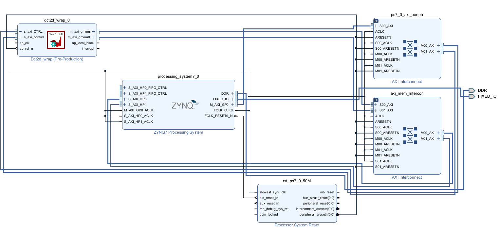

# VITIS_HLS2022_DFT
Xilinx暑期课程2022-DFT
## 总体思路
首先完成DFT运算的原型设计，之对其进行优化，对比加速后设计在运算速度上的提升。
## 原型设计
采用PP4FPGA教材中的原型。复杂度为O(n^2)。
## 加速设计
加速主要思路分为消除三角函数运算，流水线化和数组优化。
### 消除三角函数运算
由于DFT的点数为固定值1024，所以在运算时用到的所有三角函数值都是固定的。因此，可以提前将三角函数值计算好，并保存在ROM中，运算过程中直接读取，这样会节约计算三角函数消耗的时间。
###流水线化
经过分析后可以发现，在资源足够多的情况下，整个DFT计算的过程可以完全流水线化。具体过程为：
#### 流水级设置
定义数组temp_real[1024]和temp_imag[1024]存储临时数据，且temp_real[0]和temp_imag[0]分别初始化为输入数据的第一个实部和虚部。temp_real和temp_imag中的每个元素都为一个流水级。
#### 流水级工作
假设当前正在计算下标为i的输出，则流水级j执行的工作为：读取下标为[(i*j)%1024]的正弦余弦常数值（分别记为c和s）；读取下标为j的实部虚部输入sample_real[j]和sample_imag[j]；更新流水级数据temp_real[j] = sample_real[j] * c + sample_imag[j] * s + temp_real[j-1]，temp_imag[j] = sample_imag[j] * c - sample_real[j] * s + temp_imag[j-1]。
#### 流水线分析
在temp_real和temp_imag的每一级都可以同时读写的情况下，每级流水线都可以同时更新，并且位于末尾的流水级每完成一次更新，就能获得一个输出结果。另外，明确每个流水级的行为采用#pragma HLS loop flatten，流水线化采用#pragma HLS pipline II指令。
### 数组优化
在HLS代码中，存储三角函数值的数组和其他在函数内声明的数组都需要在同意时钟周期接受多次访问，因此，这里使用array_partition的宏汇编指令将这些数组完全拆分。
## 硬件设置
### 顶层I/O
由于硬件架构，输入输出数据需要由AXI总线传输，由于一条AXI总线最多支持一对读写同时进行，而DFT存在实部虚部两对读写，因此采用两条AXI总线，分别为gmem和gmem0，这一设置由宏汇编#pragma HLS INTERFACE完成。
### ROM
由于可能由多个流水级读取ROM中的同一位置，因此需要指定ROM为多端口，这里采用#pragma HLS bind_storage将ROM指定为ROM_NP类型。
### 流水级
由于每个流水级都需要能够同时读写，因此需要指定流水级为2端口RAM，这里采用#pragma HLS bind_storage将每个流水级指定为RAM_T2P类型。
## 优化效果
### HLS综合结果
未优化的DFT运算在HLS综合后，预估的延迟为80ms，经过上述优化后的DFT运算在HLS综合后，预估的延迟为0.3ms，表明上述的优化过程能够大幅加速DFT运算的速度。
### VIVADO生成的系统结构
在VIVADO中获得的整个系统结构如下图所示，ZYNQ7000模块启用2路高性能AXI总线，分别对应HLS综合得到的模块的gmem和gmem0，在使用2路AXI总线时，需要注意进行地址的配置，保证两条总线的地址不重叠，否则无法完成验证。

## 其他情况
可能由于电脑配置过低的问题，在笔记本上进行C综合，VIVADO综合都需要耗费大量时间，每一步都需要6-10小时，这浪费了我的大量时间，因此很难完成更进一步的改进。（我在流水线化时保险起见指定的II为10，但我觉得II可以更低）。

由于网络问题，我始终无法连接远程实验室中的板卡，但是在VITIS和VIVADO综合均没有问题的情况下，我觉得PYNQ上得到的效果应该和预估效果相近。
